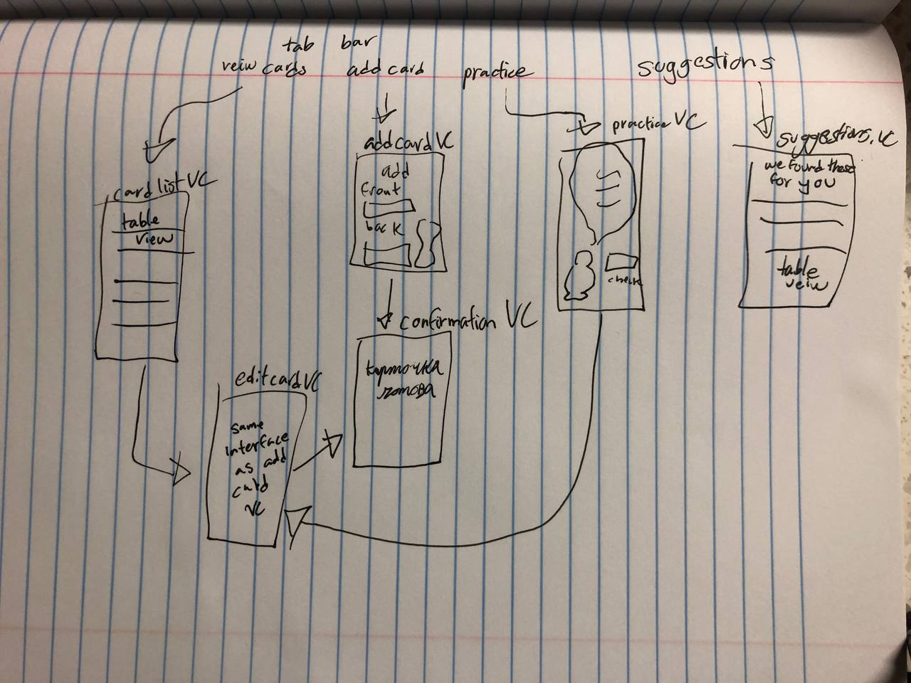

Original App Design Project - README Template
===

# Kartochki

## Table of Contents

1. [Overview](#Overview)
2. [Product Spec](#Product-Spec)
3. [Wireframes](#Wireframes)
4. [Schema](#Schema)

## Overview

## Full demo:

### Description

A flashcard app for learning Russian with the additional feature of porviding suggestion sentences for new cards. The suggestions are generated from a 100K sentence corpus of Russian sentences and translated using the  MarianMTModel transformer (see python files attached)

The app lets you:
already added:
[x] create, edit, and delete flashcards 
[x] save cards to user defaults
[x] view flashcards as list
[x] search for cards
[x] preview cards
[x] answer checker that specifically shows which parts are wrong 
[x] autofill in flashcards using translation via API call to python file with MarianMTModel installed 
[x] functions for getting random sentences from corpus and for translating them (not yet connected to app, but I have the code written)
[x] select the cards you would like to practice 
[x] a practice view that keeps track of your score and porvides modivation
[x] allows user to take photo at end 

need to add:

[] suggest sentences from the 100K sentence corpus in the "get ideas" view controller

### App Evaluation

[Evaluation of your app across the following attributes]
- **Category:** Education
- **Mobile:** It is more than a glorified website because it allows you to do flashcards anywhere. I may add the ability to take photos and add them to the flashcards. I think this would be useful for those who do not have a Russian keyboard. The rest are not applicable though to the goals of the app
- **Story:** For serious language learners this app is a huge time saver. I spend over 4 hours a day making and reviewing flashcards for my target languages, and so much of that time is spent searching for suitable sentences and new words. Thus the ability to get suggestions of high quality sentences and autofill translations would probably reduce my time spent by about an hour. 
- **Market:** Serious language learners or anyone learning Russian. The app works with any language, but the suggestions and autofill translations will only work with Russian. Also, the suggestions are more applicable for learners at the advanced level. Maybe later on I will find a corpus with simplier sentences and use it to make suitable suggestions for all levels
- **Habit:** Most language learners use flashcard apps daily or close to daily. The idea is that since you are putting in the work to make the flashcards, you will use them frequently. But I might add some extra incentive like having the user set a goal for how many cards to review a day
- **Scope:** I decided to start building the app before filling out the readme file just to get a sense for how achievable my goals will be. I would say I am about 1/3 of the way done with my app and am very confident in being able to get the rest of the 2/3rds done. If I am unable to connect my swift code to the python files, even a version with just the basic flashcards will still be a useful app.

## Product Spec

### 1. User Stories (Required and Optional)

**Required Must-have Stories**
* create, edit, and delete flashcards 
* save cards to user defaults
* view flashcards as list
* preview cards
* select cards to be tested on
* check if the user input matches the card and save a score

**Optional Nice-to-have Stories**

* autofill in flashcards using translation via API call to python file with MarianMTModel installed
*  suggest sentences from the 100K sentence corpus in the "get ideas" view controller

### 2. Screen Archetypes

* I couldn't wait and already got started on my app! Here are the screens I have so far
* main screen
  

* add card screen
  

* confirmation
  

* view cards screen
  

 
* edit card screen
  

  
* Preview screen
  

* practice screens

* card selector screen
* 

### 3. Navigation

**Tab Navigation** (Tab to Screen)

I will add one that lets you go to:
add card
view cards
practice
get suggestions

**Flow Navigation** (Screen to Screen)

- [ ] main
* add card
* view cards
* practice
* get suggestions
- [ ] add card
* get suggestions
* confirmation
- [ ] confirmation
* view cards
* main
* practice
- [ ] practice
* view cards
* main
- [ ] edit
* view cards
* main
  
## Wireframes

[Add picture of your hand sketched wireframes in this section]

### [BONUS] Digital Wireframes & Mockups

### [BONUS] Interactive Prototype

## Schema 

## [most up to date prototype]

[This section will be completed in Unit 9]

### Models

[Add table of models]

### Networking

- [Add list of network requests by screen ]
- [Create basic snippets for each Parse network request]
- [OPTIONAL: List endpoints if using existing API such as Yelp]
